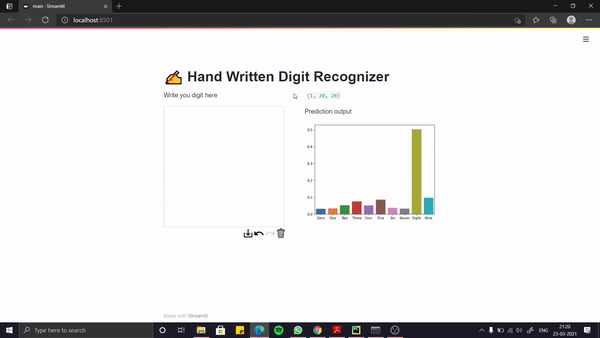

# ✍ Hand written Digit Recogniser

## ⚡ Output


## 👨‍💻 Tools and Technologies Used

1. Neural Network(ANN)
2. Tensorflow
3. keras 
4. keras tuner
5. streamlit
6. matplotlib
7. seaborn
6. Anaconda

## 🚂 How to run App

### 🔥 Requirements for the application
1. python 3.7
2. anaconda 

## How to run

1. To install all dependencies
```commandline
FOR /F "delims=~" %f in (requirements.txt) DO conda install --yes "%f" || pip install "%f"
```

2. To start Application
```commandline
streamlit run main.py
```